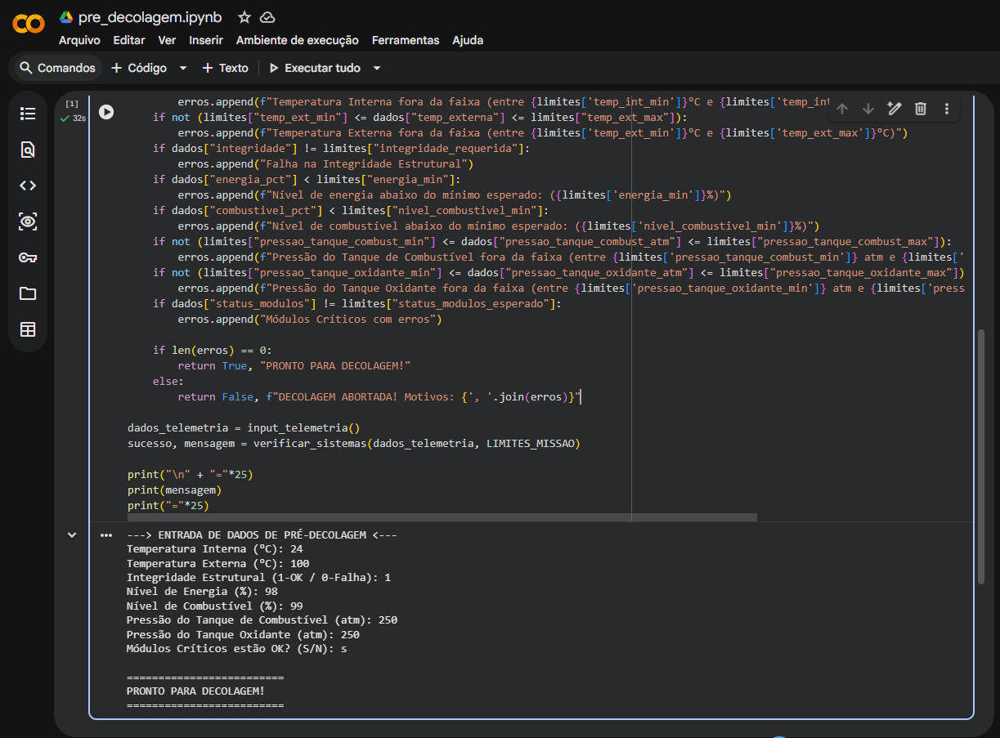
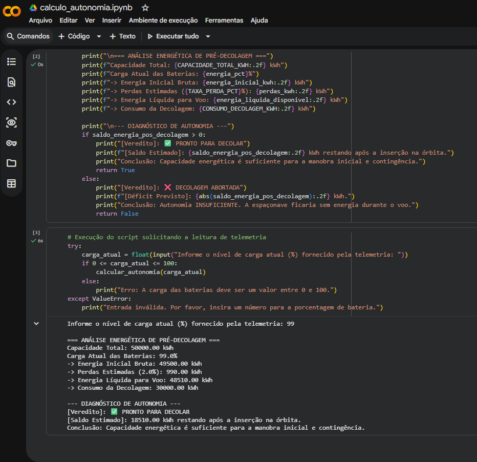
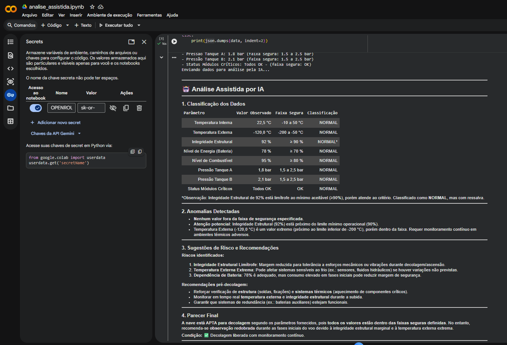

# 🚀 Relatório Operacional de Pré-Decolagem

**Atividade Integradora – FIAP | GRUPO 404**

## 👨‍💻 Integrantes

| Nome                      | RM       |
| ------------------------- | -------- |
| Fernando dos Santos Motta | rm570046 |
| Caetano de Medeiros Bona  | rm569262 |
| Joedson da Silva Souza    | rm573981 |

## 📖 Explicação do Projeto

Este repositório contém a automação da análise de pré-decolagem de um veículo espacial, avaliando em tempo real se a nave está apta para o lançamento com base na telemetria e análise auxiliada por Inteligência Artificial.

O projeto foi consolidado nos seguintes componentes principais:

- **`notebook_final.ipynb`**: Notebook unificado que contém toda a lógica do trabalho estruturada em 5 seções principais:
  - **1.1 Organização e descrição da telemetria**: Definição das faixas seguras dos sensores do foguete.
  - **1.2 Algoritmo de verificação**: Fluxograma decisório do pré-lançamento.
  - **1.3 Script em Python**: Algoritmo principal que processa a entrada de dados da telemetria e decide a autorização do lançamento.
  - **1.4 Análise energética**: Realiza o cálculo da autonomia inicial da nave cruzando dados de capacidade com perdas térmicas.
  - **1.5 Análise assistida por IA**: Integração com API da OpenRouter para identificar anomalias e gerar pareceres de mitigações de risco embasados em dados reais.
- **`telemetria.md`**: Detalhamento adicional das variáveis monitoradas com suas justificativas técnicas e fundamentação físico-termodinâmica aplicável à realidade.
- **`fluxograma.png`**: Representação visual da arquitetura de decisões programadas da telemetria.

## 🖼️ Prints da Execução

Abaixo encontram-se as evidências de execução com sucesso das respostas geradas pelo escopo do Jupyter Notebook base da atividade:

### Algoritmo de Verificação (Telemetria)



### Análise Energética



### Análise Assistida por IA



## ⚙️ Instruções de Execução do Código

A validação foi centralizada em apenas um documento _Jupyter Notebook_ (`.ipynb`). Podendo ser testada localmente ou em nuvem.

### 1. Executando em Nuvem (Google Colab - Recomendado)

Sugerimos utilizar o **Google Colab** visto que o último módulo (da IA) depende de uma _secret key_ e o Colab entrega ferramentas nativas de facilitação.

- Faça o upload de `notebook_final.ipynb` para sua própria conta do Colab.
- **Atenção à integração LLM**:
  1. Na barra lateral esquerda do Colab, abra a opção **"Secrets" (Segredos - ícone de Chave)**.
  2. Crie um novo registro com o nome literal `OPENROUTER_API_KEY` e deposite sua própria chave da API OpenRouter fornecida para o teste.
  3. Marque a verificação ("Notebook access") ativando o repasse local para permitir ser acessada pelo script do ambiente.
- Acesse o menu superior "Ambiente de execução" > "Executar tudo" ou rode bloco a bloco preenchendo as caixas interativas com os dados.

### 2. Executando Localmente (Visual Studio Code e outras)

Para executar localmente em sua IDE:

1. Certifique-se de possuir o interpretador Python 3.x ativo e o Jupyter Notebook suportado com suas extensões:

```bash
pip install jupyter requests
```

2. Defina as variáveis de ambiente manualmente ou modifique a chave string diretamente no código fonte, antes de abrir o kernel local de `notebook_final.ipynb`.

## 🗺️ Fluxograma

Para validar a linha de pensamento programada e ter uma representação visual clara das regras de restrição usadas, **abra a imagem [`fluxograma.png`](./fluxograma.png)** disponível na raiz deste mesmo repositório.
